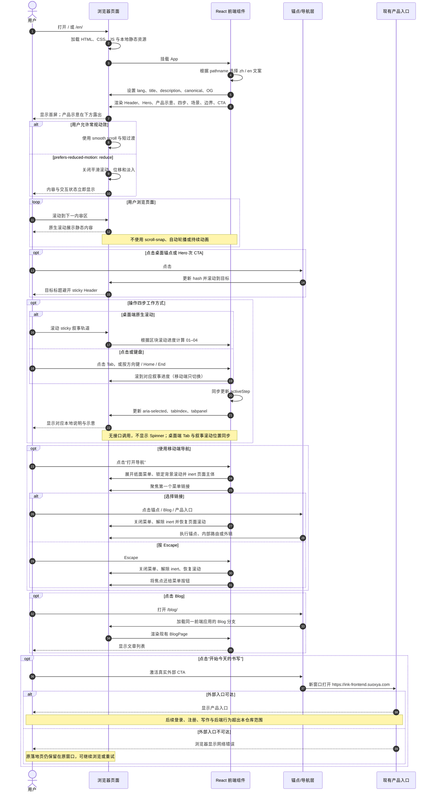
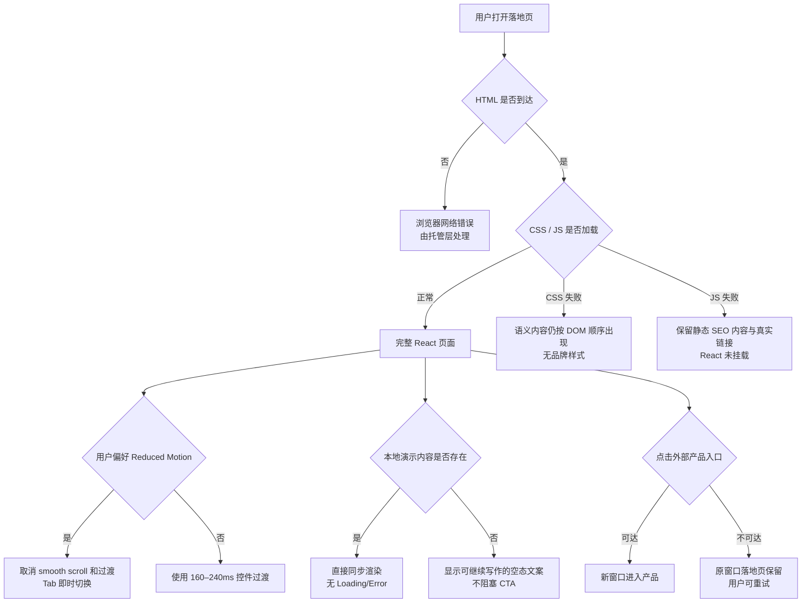

# 阶段三：业务时序流程图

## Optimized Prompt

你是 Ink Memory 落地页的产品架构与交互流程负责人。依据已通过的阶段二交互稿，使用 Mermaid `sequenceDiagram` 描述落地页真实的用户时序。参与方必须包含用户、浏览器页面、React 前端交互组件、锚点/导航层、现有产品入口；覆盖首次进入、HTML/CSS/JS 初始化、locale 与 SEO 元信息更新、浏览各区块、锚点跳转、四步 Tab、移动导航、CTA 新窗口、Blog 路由、资源异常、外部入口不可达、键盘操作和 `prefers-reduced-motion`。不得虚构登录 API、数据库、导入服务、报告服务或生产后端；进入 `https://ink-frontend.suoxya.com` 之后的登录/注册/产品行为必须标注为“外部入口，超出本仓库范围”。给出主时序和异常/降级说明，确保可直接指导 React 实现和 E2E 测试。

### Optional Enhancers

- 将每个分支映射到自动化验收点。
- 明确哪些过程完全本地同步、不会出现 Loading/Error 状态。

## 范围与假设

- `/` 与 `/en/` 由同一个 React `App` 根据 pathname 选择文案；`/blog/` 继续使用现有 Blog 组件。
- 首页所有演示和四步 Tab 数据都打包在前端，切换不请求网络，不存在业务 Loading。
- 主 CTA 指向已有外部入口 `https://ink-frontend.suoxya.com`，使用新窗口；本仓库不拥有其登录、注册、导入或写作后端流程。
- 锚点导航由浏览器 hash 与 CSS `scroll-margin-top` 完成；Reduced Motion 时关闭平滑滚动和视觉过渡。
- 页面不依赖第三方图片或远程字体，主要视觉由 HTML/CSS/Lucide 组成。
- 当前 `index.html` 与生成的页面 shell 将静态 SEO 内容放在 `<noscript>` 中：启用 JavaScript 时不会先闪出纯文本，禁用 JavaScript 时仍保留可读的静态后备。

## 主业务时序

## 异常与降级流程

## 组件状态时序

### 四步 Tab

1. 初始 `activeStep = 0`，第一项 `aria-selected=true`、`tabIndex=0`。
2. 大于 900px 时，切换器进入 sticky 状态；页面继续原生滚动，并把滚动进度等分映射到 0–3，既不锁定滚轮也不使用整屏 scroll-snap。
3. 点击或方向键在 0–3 间循环，并滚到对应叙事进度；Home/End 分别跳到第一/最后一步。
4. 900px 及以下取消 sticky 长轨道，只做本地 Tab 切换；选中项在移动端滚入水平可视区域。
5. Reduced Motion 时使用即时滚动并关闭面板位移动画。
6. 非激活面板 `hidden`，避免读屏重复；面板无异步请求，因此无 Loading/Error。

### 移动菜单

1. 初始关闭，按钮 `aria-expanded=false`。
2. 打开后 `aria-expanded=true`，菜单可见，`body` 背景滚动锁定；页面主体、Footer 和菜单外 Header 控件设为 `inert`。
3. 焦点进入首个菜单链接；Tab/Shift+Tab 在菜单按钮和链接内循环；Escape 或选择链接关闭。
4. Escape 关闭后焦点回菜单按钮；导航关闭后恢复原 body overflow。
5. 组件卸载时清理 keydown 监听和滚动锁，避免影响 Blog 页面。

## 自动化验收映射

| 时序分支 | 验收点 |
|---|---|
| 首次初始化 | `/` 与 `/en/` 的 H1、lang、title、canonical 正确；无 Mimo DOM 文本/alt/import |
| 资源加载 | 本地首页无失败资源；Console 无 error；主要视觉不请求第三方素材 |
| 锚点导航 | `#how-it-works`、`#memory`、`#boundaries` 存在且目标不被 Header 遮挡 |
| 四步切换 | 桌面滚动、Click、Arrow、Home、End 更新 `aria-selected` 与唯一可见 panel；移动端无 sticky |
| 移动菜单 | 390px 下开/关、Escape、焦点归还、背景滚动锁定正常 |
| CTA | href、target、rel 正确；不实际提交登录/注册或写作数据 |
| Reduced Motion | 媒体查询下 `scroll-behavior:auto`、过渡近零，功能仍可用 |
| 跨视口 | 1440×900、1280×800、768×1024、390×844 无横向溢出或遮挡 |

## 阶段结论

流程只涉及本地 React 状态、浏览器原生导航和已存在的外部产品入口，没有虚构服务。下一阶段可据此审查设计目标和实现可行性。
