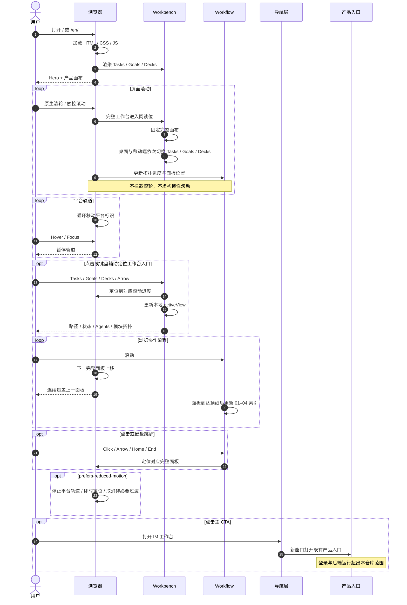
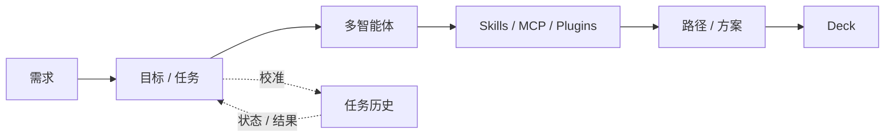
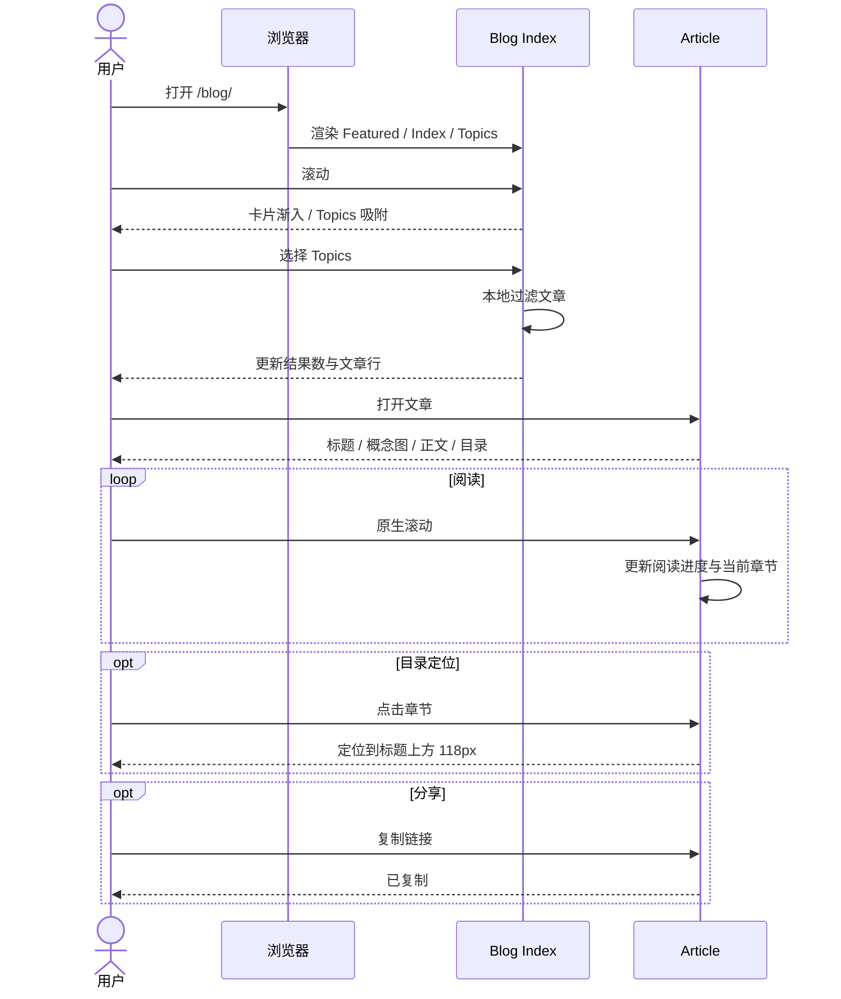

# IM 产品工作台时序图

## 页面与工作台

## 产品对象关系

## 降级

- JS 失败：保留 `index.html` / `en/index.html` 静态产品说明。
- CSS 失败：语义结构和真实链接仍可读取。
- 外部入口失败：原落地页留在原标签页。
- 移动端：工作台压缩后完整进入视口并吸附，随触控滚动切换入口；拓扑转纵向；Workflow 取消粘性叠层，四个完整流程面板线性排列。

## Blog 列表与阅读

